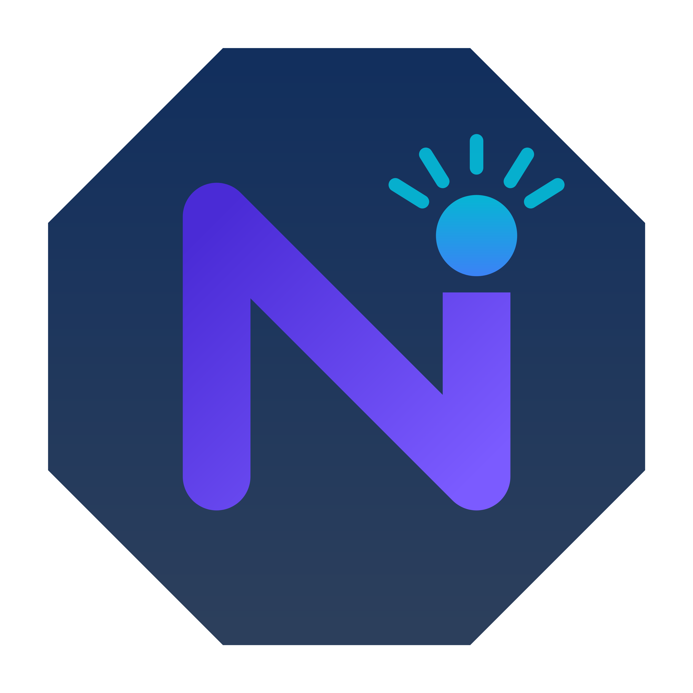

#  Neoluma

**Neoluma** *(from et.: gr. neo- & lat. -lumen, aka "New Light")* is a multi-level, general-purpose programming language designed to be *a language for everything*. 
Whether you're crafting a quick script on your knee or developing a large operating system, Neoluma is made with developer experience in mind. Featuring a clean, Python-JS-like syntax with the structure and power of C++ & C# - it's expressive, efficient, and built for modern development.

| [Website](https://neoluma.dev) | [License](./LICENSE) | [Discord](https://discord.gg/zmrB9dbmy5) | [Crowdin (Translate!)](https://crowdin.com/project/neoluma) |

## ✨ Features
- **Clean, modern syntax** inspired by Python, JavaScript, and C#
- **Static typing** with **type inference** for simplicity and safety
- Rich type system, including a custom fixed-point `number` type, plus `int`, `float`, `bool`, `string`, `set`, `dict`, `array`, `result`, and more
- Powerful decorators like `@entry`, `@comptime`, `@unsafe`, `@override`, and others
- Flexible preprocessor directives for low-level and modular control:
  - `#import` — import local or external modules (e.g., C++ bindings)
  - `#unsafe` — enable pointer operations
  - `#baremetal` — target hardware directly
  - `#macro` — define macros for compile-time logic
- **Built-in async/await** for concurrency
- **Compile-time evaluation** and an evolving **macro system (WIP)**
- **Configurable memory management** — *automatic* or *manual*, your choice
- **Cross-platform compilation with LLVM backend** for native performance
- **IDE support (planned)** — syntax highlighting, debugging, and project tools

## 📃 File Formats

- `.nm` — **Neoluma Module**: source code
- `.nlp` — **Neoluma Project**: project structure/configuration

```
project_name/
├── main.nm
├── utils.nm
└── project.nlp
```

## 🧩 Example

```neoluma
@entry
fn main() {
    name = "Neoluma";
    print("Hello, ${name}!")
}
```
> If the function doesn't have a return type, it is `void` by default — no `return` required.

## ⌨️ Usage (planned CLI)

```bash
neoluma build project.nlp #compiled way
neoluma run main.nm #interpreted way
```


## 🗺️ Roadmap

- [x] Lexer
- [x] Parser
- [x] Semantic Analyzer (~10%)
- [ ] LLVM IR Compiler
- [ ] CLI Toolchain
- [ ] Cross-platform support (Linux / Windows / macOS / Android / iOS / etc.)
- [ ] Plugin system and editor integration
- [ ] Transpilation support (C++, JS, etc.)

## 🕶️ Vision

Neoluma aims to be a unified language that bridges low-level control and high-level productivity. It is designed for:

- Systems programming (including OS kernels)
- Cross-platform apps and utilities
- Educational tools and experimentation
- Scripting with performance
- Future self-hosting development

## 🚦 Status

Neoluma is in early development. Contributions and feedback are welcome!

## 🔧 Building from source

Neoluma can be built from cloned source via building scripts.
- [Windows](./build.bat)
- [Unix](./build.sh) (may require `chmod +x build.sh`)

It doesn't require much input aside from just running the script.
Usage:
```
./build.<ext> [release|debug] [neoluma|payload|installer|all] [--no-install (available only on Unix)]
```
It generates the full installation output at `./.build/.runtime/[Debug|Release]/`

## 📖 Credits

**Created by [TsukimotoX](https://github.com/TsukimotoX) under [Apache License](./LICENSE)**. 

**Neoluma™** is a [trademark](./TRADEMARK.md) of the **Neoluma** project; the name and branding are **not granted** under the Apache-2.0 license.

More documentation and compiler features coming soon!
**Join our [Discord server](https://discord.gg/zmrB9dbmy5)!**

Help us translate Neoluma to other languages via **our [Crowdin!](https://crowdin.com/project/neoluma)**

This project uses [LLVM](https://llvm.org/) under the Apache License v2.0 with LLVM Exceptions.
