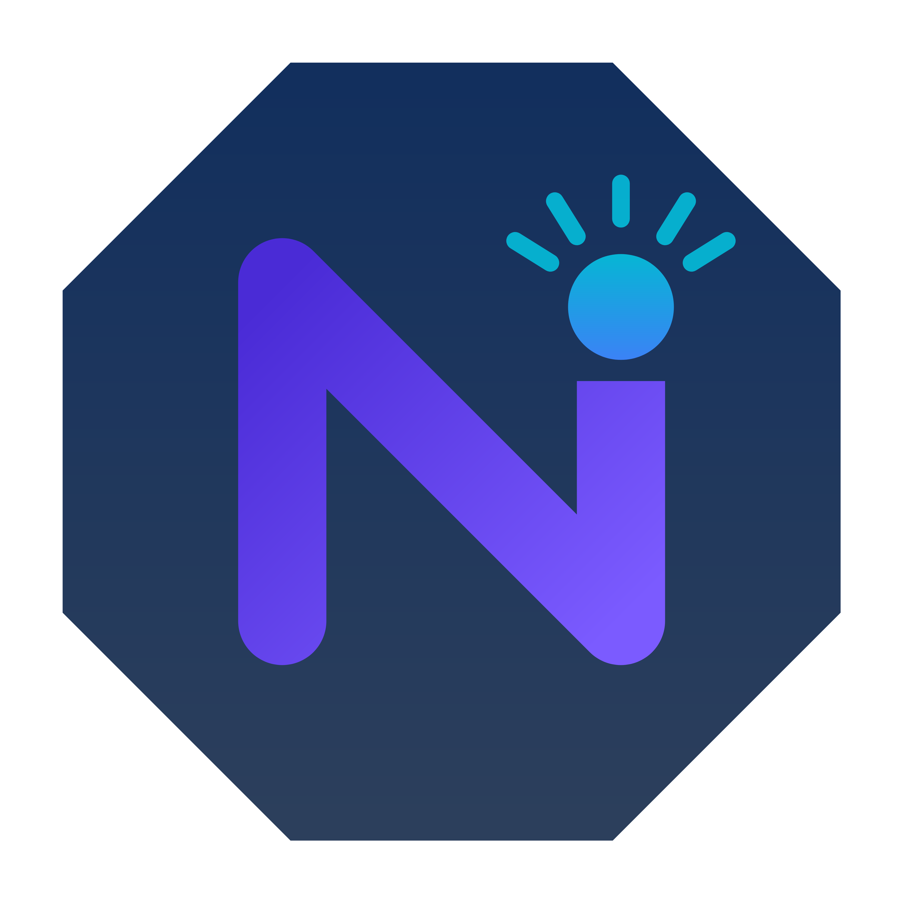

# Neoluma

**Neoluma** is a high-level, all-purpose programming language designed to be a language for everything. Whether you're writing a small script or building an entire operating system, Neoluma is made to scale with you. With a Python-like syntax and C#/C++-inspired architecture, it's both expressive and powerful.

---

## Features

- **Modern, readable syntax** inspired by Python and C#
- **Statically typed** with optional type inference
- **Custom fixed-point `number` type**, plus `int`, `float`, `bool`, `string`, `set`, `dict`, `array`, `result`, `void`
- **Annotations and decorators**: `@entry`, `@comptime`, `@unsafe`, `@override`, etc.
- **Preprocessor directives**:
  - `#unsafe` — for making pointers work in a file
  - `#import` — for local `.nm` Neoluma modules and for external libraries(e.g., C++ bindings)
  - `#baremetal` - for working with bare-metal and etc.
  - `#macro` - for giving a definition of something to something
- **Async/await** built into the language
- **Compile-time evaluation**, lambdas, and macro system (WIP)
- **Automatic and manual memory management**
- **Cross-platform design** with potential for OS development
- **LLVM backend** to compile into fast, native machine code
- **Planned IDE integration** with syntax highlighting and debugging

---

## File Formats

- `.nm` — **Neoluma Module**: source code
- `.nlp` — **Neoluma Project**: project structure/configuration

```
project_name/
├── main.nm
├── utils.nm
└── project.nlp
```

---

## Example

```neoluma
@entry
fn main() {
    name = "Neoluma";
    print("Hello, {name}!")
}
```
> If the function doesn't have a return type, it is `void` by default — no `return` required.

---

## Usage (planned CLI)

```bash
neoluma build project.nlp #compiled way
neoluma run main.nm #interpreted way
```

---

## Roadmap

- [x] Lexer
- [x] Parser
- [x] Semantic Analyzer (~10%)
- [ ] LLVM IR Compiler
- [ ] CLI Toolchain
- [ ] Cross-platform support (Linux / Windows / macOS / Android / iOS / etc.)
- [ ] Plugin system and editor integration
- [ ] Transpilation support (C++, JS, etc.)

---

## Vision

Neoluma aims to be a unified language that bridges low-level control and high-level productivity. It is designed for:

- Systems programming (including OS kernels)
- Cross-platform apps and utilities
- Educational tools and experimentation
- Scripting with performance
- Future self-hosting development

---

## Status

Neoluma is in early development. Contributions and feedback are welcome!

---

**Created by [Tsukimoto](https://github.com/TsukimotoX) in collaboration with [PYROLYSIS](https://github.com/pyr0lysis) under  [Apache License](./LICENSE)** — more documentation and compiler features coming soon!

**Discord server for Support and Questions**
[Coming soon!]

This project uses [LLVM](https://llvm.org/) under the Apache License v2.0 with LLVM Exceptions.
